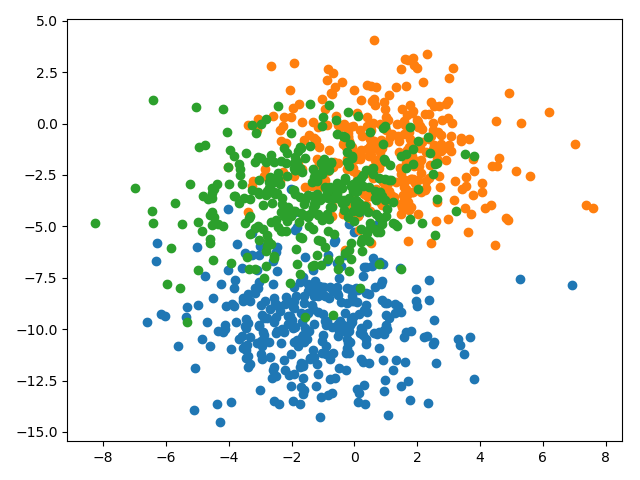

## Findings about configuring capacity with nodes and layers

### Problem description

A multiclass classification problem is used to demonstrate the effect of model capacity on model performance. Concretely,
the problem consists of 20 classes, 100 input features and a dataset size of 1000, which is contrived using the
scikit-learn `make_blobs()` function. The kind of problem is illustrated by the following simplified version with only 3
classes and only 2 input features.

### Too many nodes using only one hidden layer

As the following line plots of the final training error and the test accuracy show, a suitable number of nodes seems to
be somewhere between 6 and 16. With more than 16 nodes the performance of the model decreases as the model becomes too
complex for the training dataset. Interestingly, the models with 30, 34 and even 50 nodes perform well which is due to
the stochastic nature of the learning algorithm.

 

### Too many hidden layers using 10 nodes per layer

A model with up to 3 hidden layers can learn the problem perfectly. However, using more hidden layers causes the model
to decrease in performance as is illustrated by the training error and test accuracy line plots below.

 

### Harder problem

Increasing the size of the dataset fivefold and using a 70/30 train/test split results in a model with 4 hidden layers
being able to learn the problem perfectly as opposed to the simpler problem where a model with at most 3 hidden layers
was able to perform well. Models with 5 hidden layers or more did perform consistently poorly. I suppose such deep
networks require additional measures such as addressing the problem of vanishing gradients in order to perform well.

 
