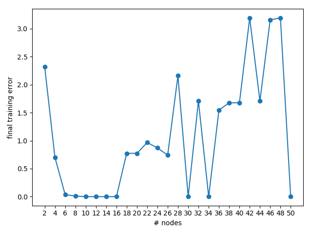
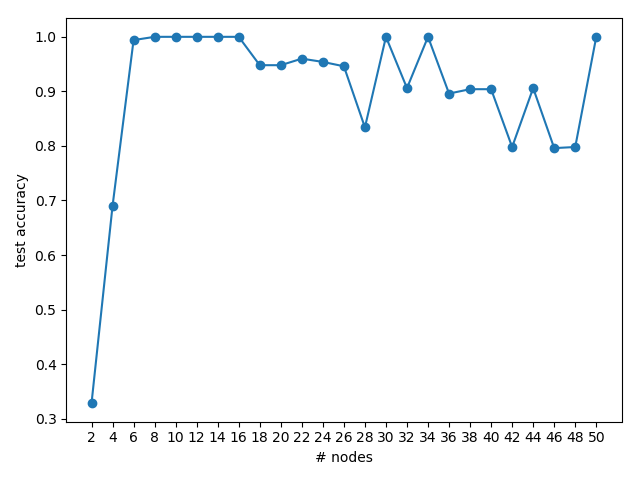

## Findings about configuring capacity with nodes and layers

### Too many nodes using only one hidden layer

As the following learning curves of the final training error and the test accuracy show, a suitable number of nodes seem
to be somewhere between 6 and 16. With more than 16 nodes the performance of the model decreases as the model becomes
too complex for the training dataset. Interestingly, the models with 30, 34 and even 50 nodes perform well which is due
to the stochastic nature of the learning algorithm.

 
