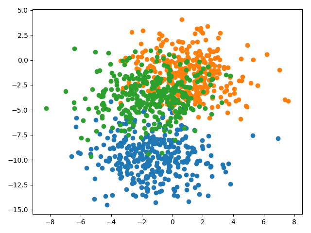
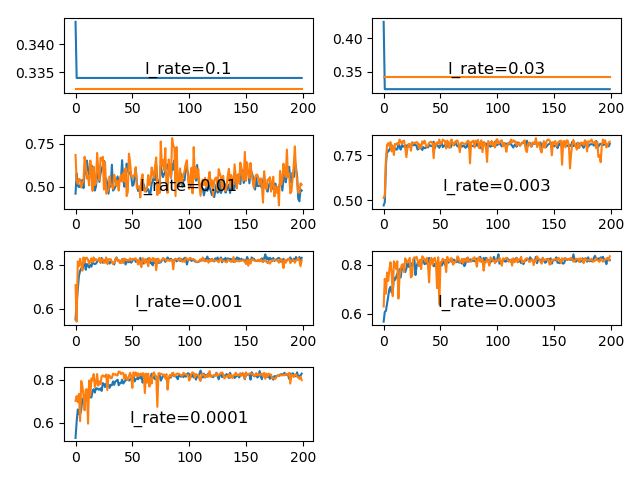

## Findings about configuring gradient precision with batch size

### Problem description

A multiclass classification problem is used to demonstrate the effect of gradient descent batch size on the accuracy of
the estimate of the error gradient. Specifically, the problem consists of 3 classes, 2 input features and a dataset size
of 1000, which is contrived using the scikit-learn `make_blobs()` function.

### Varying the learning rate with stochastic gradient descent

As having learnt, the learning rate must be chosen smaller when using stochastic gradient descent (batch size of 1) as
compared to when applying batch gradient descent. This is because having seen just 1 training example the gradient
estimate isn't that accurate resulting in noisy weight updates. Hence, a small learning rate is needed for a stable
learning process. It can be seen in the following line plots that learning rates of 0.1, 0.03 and 0.01 make the learning
process unstable. On the other hand, when the learning rate becomes to small the speed of convergence is slowed down as
is exemplified by the line plots with learning rates of 0.0003 and 0.0001. According to these learning curves, a learning
rate of 0.001 seems to be a good choice for this specific problem and model configuration as the learning process
converges fast with relatively little variance in the classification accuracy.

