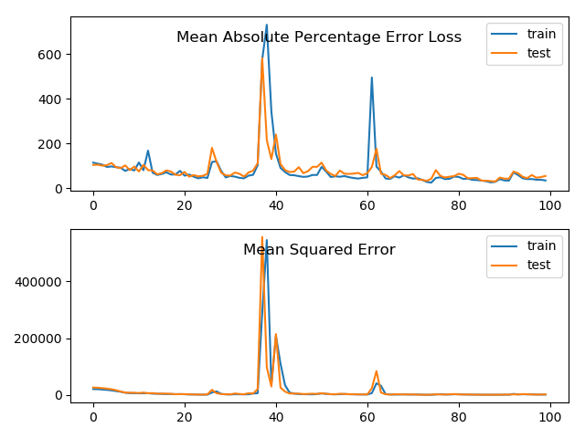

## Findings about configuring what to optimize with loss functions

### Regression problem description

The regression problem used to demonstrate the effect of loss functions (the ones used with regression) on the speed,
stability and performance of the learning process is contrived by means of the scikit-learn `make_regression()` function.
Specifically, the dataset consists of 1000 examples (evenly split into train and test sets), 20 input features with a
noise of 0.1.

### Alternate regression loss

The mean absolute percentage error (MAPE) loss function doesn't work well with target values close to zero. This is
because the target values appear in the denominator of the MAPE function, causing the error to take on huge values in
such cases. Therefore, the problem has been adjusted so that the target values are not standardized. Even with this
adjustment the corresponding MSE is quite bad: `Train: 1466.628, Test: 1763.889`. As the following learning curves also
show, the learning process converges slowly, is bumpy and has bad final performance. Hence, MAPE is not a good loss
function for this kind of data.

