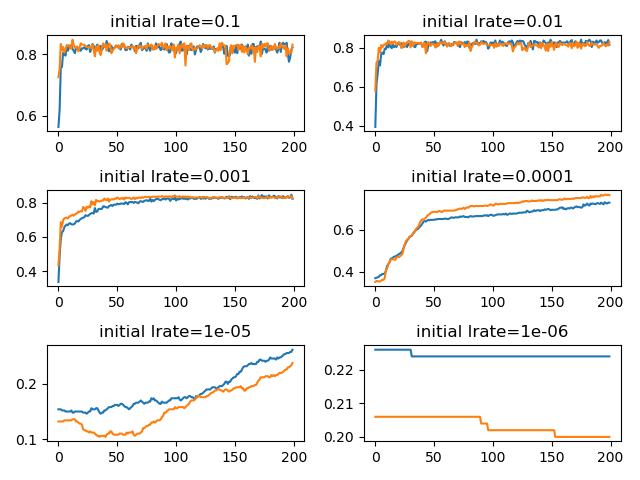

## Findings about configuring speed of learning with learning rate

### Problem description

A multiclass classification problem is used to demonstrate the effect of the learning rate on the speed of learning.
Specifically, the problem consists of 3 classes, 2 input features and a dataset size of 1000, which is contrived using
the scikit-learn `make_blobs()` function.

### Varying the initial learning rate with an adaptive learning rate optimization algorithm

The following learning curves show the accuracy performances for the different initial learning rates. Train accuracy is
plotted in blue, whereas test accuracy is shown in orange. Adam is used as the optimizer in each case. With the two
largest learning rates of 0.1 and 0.01 the problem is learnt fast but exhibits some volatility in accuracy throughout.
Modest chosen values of 0.001 and 0.0001 show less variation in accuracy, although with the latter not having converged
yet needing longer training. Finally, the two smallest values, 1e-5 and 1e-6, result in unstable not converged models.

