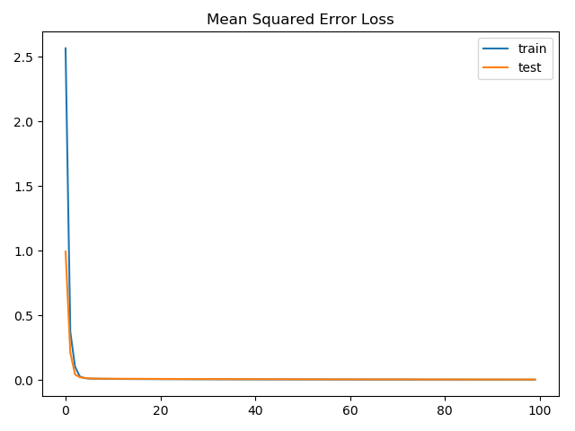
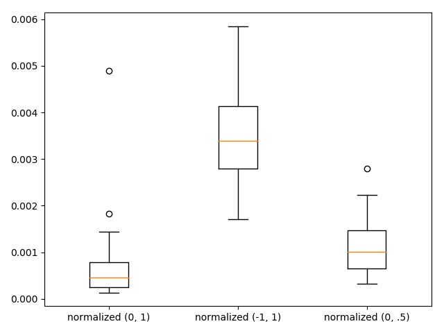

## Findings about stabilizing learning with data scaling

### Problem description

The regression problem used to demonstrate the effect of data scaling on the stability of the learning process is
contrived by means of the scikit-learn `make_regression()` function. Specifically, the dataset consists of 1000 examples
(evenly split into train and test sets), 20 input features with a noise of 0.1.

### Normalize target variable

Normalizing the target variable seems to perform even a little better than using standardization. Running 4 experiments
results in a mean train error of 0.002 and mean test error of 0.004 (each rounded to 3 decimals). In addition, the model
learns faster having converged already after about 5 epochs as compared to about 30 epochs when the target variable is
standardized.

### Evaluate different normalization ranges

A model's performance is evaluated on different normalization ranges. Each range is evaluated 30 times to ensure the mean
is statistically robust. Both the input and output variables are normalized. The following box and whisker plot compares
the resulting test mean squared errors. Normalization with a standard range of (0, 1) works best. The median test error
is about 0.0005 with little variance. A bit worse performs a model where the input and output variables have been
normalized with a range of (0, .5). Normalization with a range of (-1, 1) performs worst exhibiting a median test error
of about 0.0035 having some variance. I suppose this is due to the rectified linear activation function which maps
negative values to 0.

