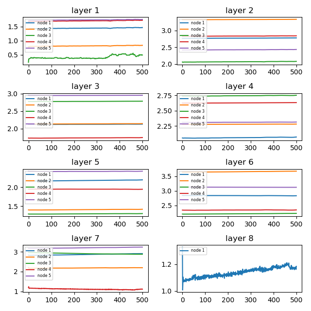
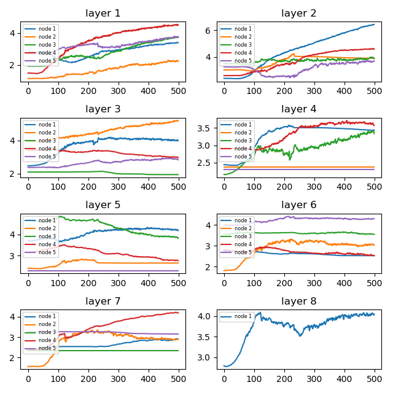

## Findings about fixing vanishing gradients with ReLU

### Problem description

The binary classification problem used to demonstrate the effect of using ReLU to address the problem of vanishing
gradients is contrived by means of the scikit-learn `make_circles()` function. Specifically, the dataset consists of
1000 examples (evenly split into train and test sets), 2 input features with a noise of 0.1.

### Using Xavier initialization

Using a deep MLP with tanh as its activation function for the hidden layers and initializing the weights randomly and
uniformly from the range [0, 1] resulted in very poor performance with the model not being able to learn the problem.
However, initializing the weights using the Xavier uniform method with the network configuration otherwise unchanged
resulted in rather good accuracy performance of `train: 0.814, test: 0.840`. This confirms the known fact that a suitable
combination of the weight's initialization method and the applied activation function for a given hidden layer is
crucial. The following learning curves also show that the problem has been learnt as soon as after about 100 epochs.

### Using an adaptive learning algorithm

As mentioned the deep MLP with tanh as its activation function for the hidden layers and using SGD with momentum
resulted in very poor performance. The model with exactly the same network configuration except of using Adam as the
optimizer was able to learn the problem well with an accuracy performance of `train: 0.828, test: 0.838`. This suggests
that a learning process with adaptive learning rates for each individual weight is able to prevent vanishing gradients
to a great extent. The following learning curves illustrate that initially the training process learnt fast and improved
continuously but more slowly from then on. Perhaps, the learning process has been stopped too early.

### Evaluating weight changes

In order to observe the issue of vanishing gradients the updates to the model weights can be evaluated. The following
two figures plot the L1 norm of the model weights for each node in a layer against the number of epochs.

The plot below shows the weight norms of a network with 8 layers using the tanh activation function for its nodes. It
can be observed that there is a vanishing gradients problem as the weights hardly change except for the output layer.

A model with the same structure except for applying relu as the activation function doesn't suffer from vanishing
gradients. This is illustrated by the plot below from which can be seen that the model weights are updated back through
the first layer.

