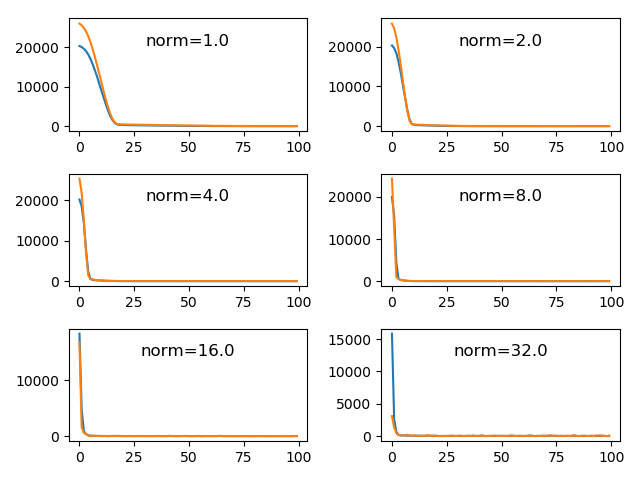
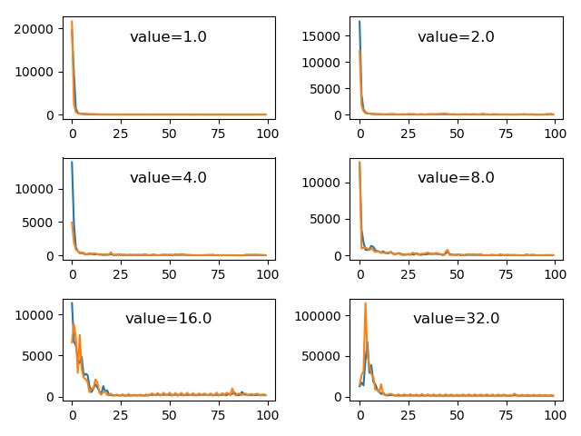

## Findings about fixing exploding gradients with gradient clipping

### Problem description

The regression problem used to demonstrate the effect of gradient clipping on the stability of the learning process is
contrived by means of the scikit-learn `make_regression()` function. Specifically, the dataset consists of 1000 examples
(evenly split into train and test sets), 20 input features with a noise of 0.1.

### Applying gradient norm scaling

The following table shows the mean squared errors of the train and test sets for different norm values ranging from 1.0
up to 32.0. According to these particular training runs a norm of 2.0 or 4.0 results in best performance. When the norm
is chosen too large performance degrades as can be observed by the relatively large mean squared errors of norm 16.0 and
32.0.

| Norm | Train MSE | Test MSE |
|-----:|----------:|---------:|
| 1.0  | 1.455     | 17.541   |
| 2.0  | 1.131     | 10.977   |
| 4.0  | 4.078     | 10.146   |
| 8.0  | 7.132     | 10.738   |
| 16.0 | 22.950    | 25.313   |
| 32.0 | 63.401    | 87.309   |

The figure below shows the learning curves for the different gradient scaling norms. It can be observed that speed of
learning increases with larger norm values. Whereas about 20 epochs are needed to achieve convergence when a norm value
of 1.0 is applied, only about 5 epochs are required for convergence using norm values of 4 or above. This coincides with
the fact that the larger the gradients the larger are the updates to the model weights, which results in faster learning.
However, as the table of the MSE above points out, too large gradients result in worse performance.

### Applying gradient value clipping

The following table shows the mean squared errors of the train and test sets for different clipping values ranging from
1.0 up to 32.0. According to these particular training runs a value of 2.0 results in best performance. In particular,
if the clipping value is chosen too large (16.0 and above) performance degrades dramatically.

| Value | Train MSE | Test MSE |
|------:|----------:|---------:|
| 1.0   | 22.925    | 28.400   |
| 2.0   | 9.272     | 12.915   |
| 4.0   | 22.944    | 28.434   |
| 8.0   | 39.256    | 55.896   |
| 16.0  | 121.774   | 153.598  |
| 32.0  | 546.602   | 843.060  |

The figure below shows the learning curves for the different gradient clipping values. Speed of learning seems to be
always fast except for the two largest values of 16.0 and 32.0 where the performance is bad as well.

With this specific problem and model configuration gradient norm scaling seems to work a little better than gradient
value clipping.
