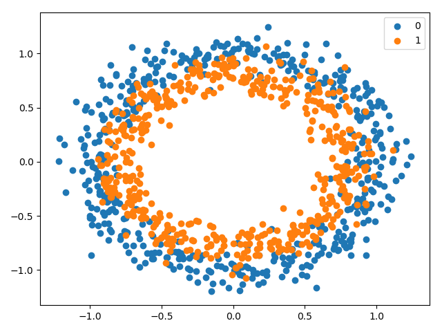
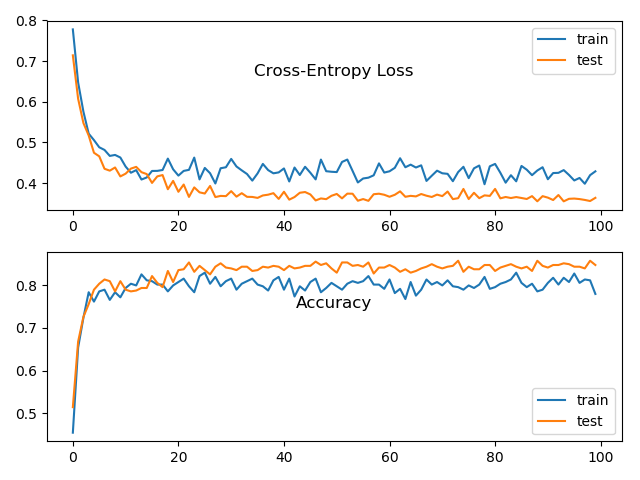

## Findings about accelerating learning with batch normalization

### Problem description

The binary classification problem used to demonstrate the effect of batch normalization on the stability and speed of
learning is contrived by means of the scikit-learn `make_circles()` function. Specifically, the dataset consists of 1000
examples (evenly split into train and test sets), 2 input features with a noise of 0.1.

### Applying batch normalization without rescaling

As a baseline serves the model with batch normalization applied after the activation function. This baseline model is
compared to a model using batch normalization without beta and gamma parameters, i.e. the input distribution has fixed
zero mean and unit variance. Each model is trained three times and the averages of their performances on the train and
test sets are taken. With this particular problem whether using batch normalization with or without rescaling results in
almost identical performance. Using beta and gamma batch normalization parameters yields average accuracy performances
of `train: 0.832, test: 0.844` compared to `train: 0.832, test: 0.852` without using rescaling.

This similarity in the learning process is also reflected in the learning curves plot when batch normalization without
beta and gamma is used:

