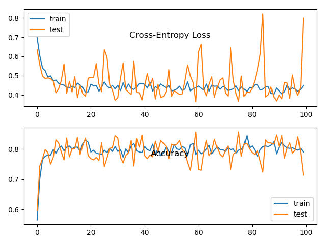
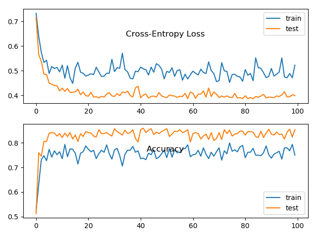

## Findings about accelerating learning with batch normalization

### Problem description

The binary classification problem used to demonstrate the effect of batch normalization on the stability and speed of
learning is contrived by means of the scikit-learn `make_circles()` function. Specifically, the dataset consists of 1000
examples (evenly split into train and test sets), 2 input features with a noise of 0.1.

### Applying batch normalization without rescaling

As a baseline serves the model with batch normalization applied after the activation function. This baseline model is
compared to a model using batch normalization without beta and gamma parameters, i.e. the input distribution has fixed
zero mean and unit variance. Each model is trained three times and the averages of their performances on the train and
test sets are taken. With this particular problem whether using batch normalization with or without rescaling results in
almost identical performance. Using beta and gamma batch normalization parameters yields average accuracy performance
of `train: 0.832, test: 0.844` compared to `train: 0.832, test: 0.852` without using rescaling.

This similarity in the learning process is also reflected in the learning curves plot when batch normalization without
beta and gamma is used:

### Applying batch normalization without momentum

As a baseline serves the model with batch normalization applied after the activation function. This baseline model is
compared to a model using batch normalization without momentum, i.e. the metrics (mean and variance) to standardize the
input variables are obtained by the current minibatch only. Each model is trained three times and the averages of their
performances on the train and test sets are taken. With this particular problem using batch normalization without
momentum results in much worse average accuracy performance of `train: 0.738, test: 0.740` as compared to `train: 0.832,
test: 0.844` when using momentum with a value of 0.99.

As the following plot of the learning curves shows the learning process is also much more volatile. Especially the loss
and accuracy of the test set exhibit a lot of fluctuations, which can be explained by the fact that using only the
statistics of the current minibatch is likely not to be representative of the underlying distribution. A measure to
alleviate this problem could be to increase the minibatch size.

### Applying batch normalization on input layer

As a baseline serves the model with batch normalization applied after the activation function. This baseline model is
compared to a model applying batch normalization also on the input layer. Each model is trained three times and the
averages of their performances on the train and test sets are taken. With this particular problem whether applying batch
normalization on the input layer or not results in almost identical performance. Applying batch normalization on the
input layer yields average accuracy performance of `train: 0.822, test: 0.845` compared to `train: 0.832, test: 0.844`
without batch normalization on the input layer.

This similarity in the learning process is also reflected in the learning curves plot when batch normalization is
applied to the input layer:

