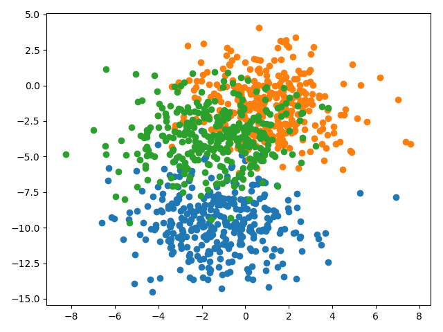
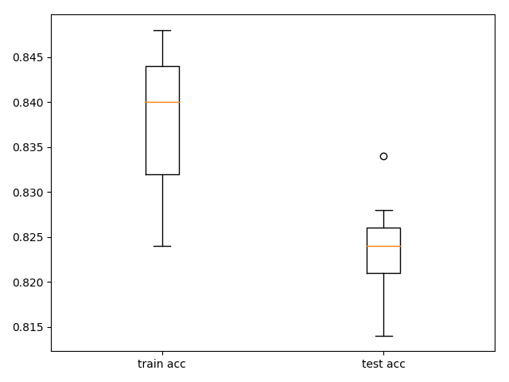
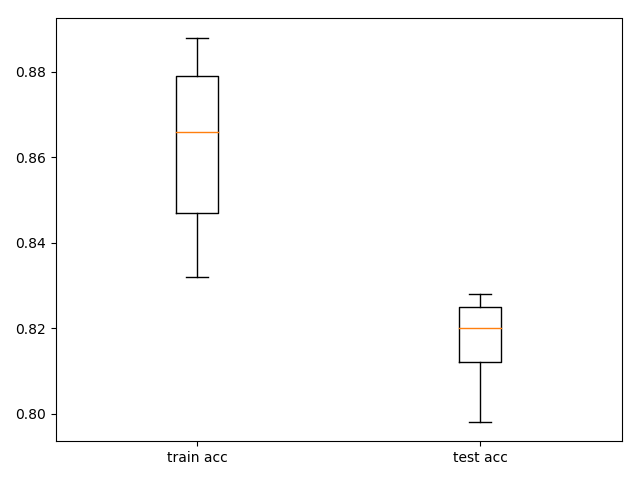

## Findings about deeper models with greedy layer-wise pretraining

### Problem description

A multiclass classification problem is used to demonstrate the effect of greedy layer-wise pretraining on the capability
to train deeper models. Specifically, the problem consists of 3 classes, 2 input features and a dataset size of 1000,
which is contrived using the scikit-learn `make_blobs()` function.

### Fine-tuning the supervised pre-trained model

The following box and whisker plot presents statistics of the accuracy performance on the train and test sets of a model
having only been greedily layer-wise pre-trained, i.e. without having fine-tuned the model afterwards. The values in
either box are the classification accuracies as evaluated against the different numbers of layers, ranging from 2 to 12
layers. As can be seen the median classification accuracy on the train set is about 0.84, whereas on the test set this
metric is slightly below 0.825.

Applying fine-tuning on the model improves the performance mainly on the train set. The pre-training phase is followed
by a supervised fine-tuning learning phase for each added layer using a smaller learning rate of 0.001 and a larger
number of epochs of 500. The box and whisker plot below shows that the median classification accuracy on the train set
has increased to almost 0.87, whereas the performance on the test set is comparable to the training process where no
fine-tuning of the model has been applied. This indicates a bit of a variance problem of the model. However, this seems
acceptable as the main first goal with a training process in general is to achieve very good results on the train set
and when having achieved that one can tackle the problem of overfitting.

### Fine-tuning the unsupervised pre-trained model prior fitting a classifier

The model has been fine-tuned in an unsupervised fashion prior fitting a classifier output layer. The fine-tuning
learning phase uses a smaller learning rate of 0.001 and a larger number of epochs of 500 as compared to the pre-
training phase using a learning rate of 0.01 and 100 epochs. The following table shows the mean squared errors of the
train and test sets for the different number of layers used. As can be seen both the train and test MSEs remain close to
zero for all model configurations. Without fine-tuning the MSEs had been steadily increasing as layers have been added.

| # Layers | Train MSE | Test MSE |
|---------:|----------:|---------:|
| 2        | 0.001     | 0.001    |
| 3        | 0.001     | 0.002    |
| 4        | 0.002     | 0.004    |
| 5        | 0.002     | 0.004    |
| 6        | 0.002     | 0.004    |
| 7        | 0.000     | 0.003    |

The following table depicts the train and test accuracies for the model having been fine-tuned. Relatively constant
accuracies have been achieved for both the train and test sets. As just shown by the reconstruction errors above
applying fine-tuning to the model a nearly perfect autoencoder could be obtained regardless the number of layers.

| # Layers | Train Acc | Test Acc |
|---------:|----------:|---------:|
| 2        | 0.842     | 0.834    |
| 3        | 0.830     | 0.832    |
| 4        | 0.828     | 0.838    |
| 5        | 0.824     | 0.826    |
| 6        | 0.822     | 0.832    |
| 7        | 0.834     | 0.828    |
