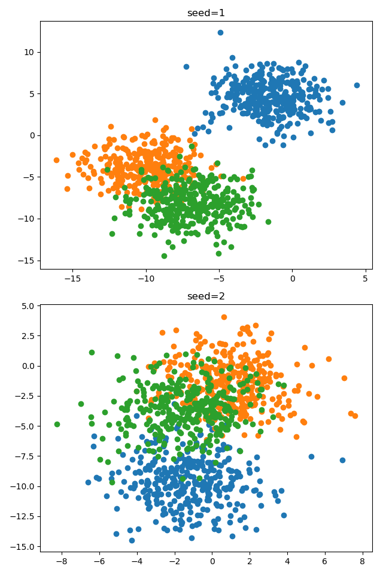
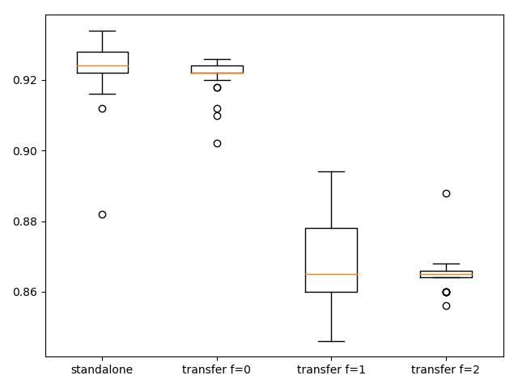
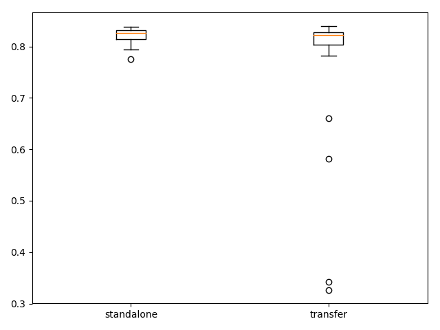

## Findings about jump-start training with transfer learning

### Problem description

A multiclass classification problem is used to demonstrate transfer learning. Specifically, the problem consists of 3
classes, 2 input features and a dataset size of 1000, which is contrived using the scikit-learn `make_blobs()` function.
Two instances of this problem are created using different seeds for the pseudorandom number generator: the one with a
seed of 1 is referred to as problem 1 and the other with a seed of 2 is referred to as problem 2.

### Evaluating transfer learning model on problem 1
A model trained on problem 2 has been saved, which will be used for a transfer learning model trained on problem 1. The
following box and whisker plot compares the accuracy performance on the test set between a standalone model and three
transfer learning models with different numbers of fixed layers. Each model is trained 30 times to achieve statistical
stability. The standalone model and the transfer learning model with all its layers trainable (i.e. transfer learning
used as a weight initialization scheme) perform best, both having a median accuracy performance of slightly above 0.92,
although the transfer learning model showing less variation.

### Evaluating transfer learning model on problem 2 with additional hidden layer

A standalone model trained on problem 2 serves as a baseline and achieves test accuracy performance of 0.822 with a
standard deviation of 0.013 on average when trained 30 times. Transfer learning has been conducted by loading a model
trained on problem 1 keeping its two hidden layers fixed and adding a third hidden layer and output layer with their
weights initialized randomly. Running this experiment also 30 times the transfer learning model achieves on average a
test accuracy performance of 0.773 with a standard deviation of 0.128. The performance of the transfer learning model
is slightly worse than that of the standalone model. This can also be seen by the following box and whisker plots. The
plot of the transfer learning model exhibits some outliers meaning that it may perform pretty badly.

