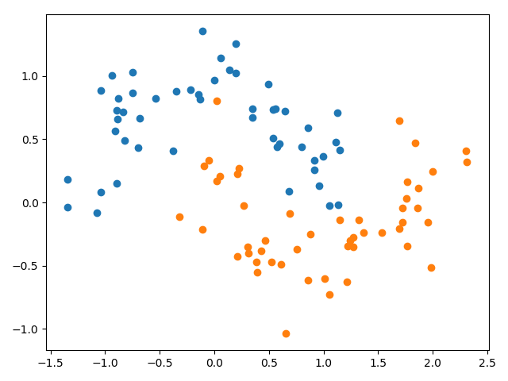

## Findings about penalizing large weights with weight regularization

### Problem description

A binary classification problem is used to demonstrate the effect of weight regularization to reduce overfitting of a
model. Specifically, the problem has 2 input features and a dataset size of 100 with a noise of 0.2, which is contrived
using the scikit-learn `make_moons()` function.

### Reporting weight norms

In order to show that weight regularization indeed decreases the magnitudes of the weights the L2 norm (Euclidean length)
of the hidden layer's weights is measured. Without regularization the L2 norm of the hidden layer's weights is `11.969`
as compared to `3.243` when using L2 regularization with lambda set to 0.001.
