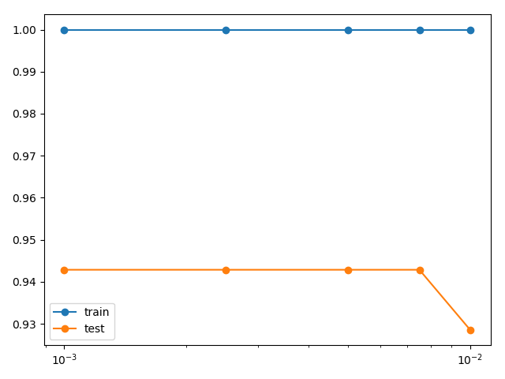

## Findings about penalizing large weights with weight regularization

### Problem description

A binary classification problem is used to demonstrate the effect of weight regularization to reduce overfitting of a
model. Specifically, the problem has 2 input features and a dataset size of 100 with a noise of 0.2, which is contrived
using the scikit-learn `make_moons()` function.

### Reporting weight norms

In order to show that weight regularization indeed decreases the magnitudes of the weights the L2 norm (Euclidean length)
of the hidden layer's weights is measured. Without regularization the L2 norm of the hidden layer's weights is `11.969`
as compared to `3.243` when using L2 regularization with lambda set to 0.001.

### Regularizing output layer
The model having regularization applied only to its hidden layer serves as a baseline and exhibits accuracy performance
of `train: 1.000, test: 0.943`. Compared to this is a model having regularized also its output layer with the same value
for lambda of 0.001. This model configuration has accuracy performance of `train: 1.000, test: 0.929`. Test performance
is slightly worse as when not regularizing the output layer. 

### Conducting fine-grained grid search
Conducting a fine-grained grid search between the most promising lambda parameter values of 0.01 and 0.001 has not
resulted in a better performing model. The following plot of train and test performances against the different values
for the lambda parameter values shows that in particular the test accuracy performance remains constant slightly above
0.94.

