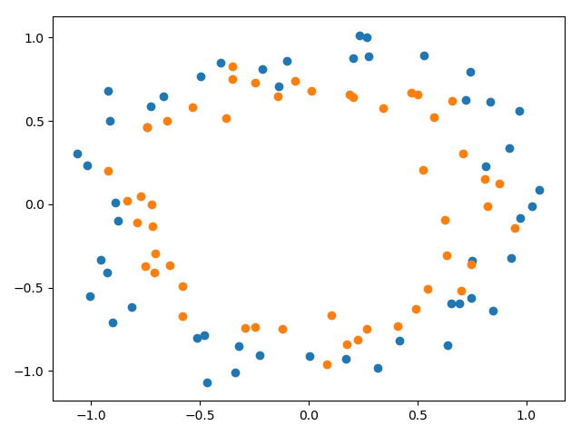

## Findings about sparse representations with activity regularization

### Problem description

The binary classification problem used to demonstrate the effect of using activity regularization to address the problem
of overfitting is contrived by means of the scikit-learn `make_circles()` function. Specifically, the dataset consists
of 100 examples (with a 30/70 train/test split) with 2 input features and a noise of 0.1.

### Reporting activation mean
In order to confirm that activity regularization has made the outputs of the regularized layer more sparse and smaller a
baseline model is compared to a model having its hidden layer regularized before the ReLU activation function is applied.
The activations are evaluated on the 70 examples of the test set. As the hidden layer has 500 nodes, the total number of
activations evaluated accounts to 35,000. The mean activation value of the baseline model is about `0.328`, whereas the
mean activation value of the regularized model is decreased to roughly `0.019`. This shows that activity regularization
clearly takes effect. The proportion of exactly zero activations with the regularized model is about `0.506`, that is
approximately half of them. Interestingly, the proportion of exactly zero activations with the baseline model is as high
as `0.463`, just about 4% less than when activity regularization is applied. This indicates that the ReLU activation
function encourages sparsity in the hidden layer to a great extent on its own. In combination with ReLU as the activation
function activity regularization additionally forces the magnitudes of the activations to become much smaller.
