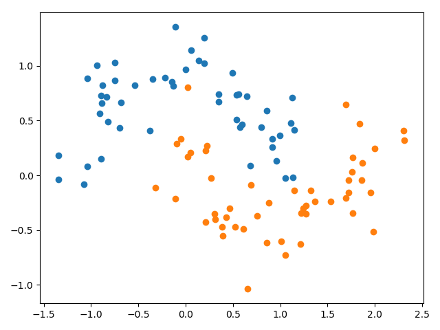

## Findings about forcing small weights with weight constraints

### Problem description

A binary classification problem is used to demonstrate the effect of weight constraints to reduce overfitting of a
model. Specifically, the problem has 2 input features and a dataset size of 100 with a noise of 0.2, which is contrived
using the scikit-learn `make_moons()` function.

### Reporting weight norms

In order to show that weight constraints indeed normalizes the magnitudes of the weights the L2 norm (Euclidean length)
of the incoming weights to each hidden layer's unit is measured. Without using weight constraints the mean of the L2
norms is about `0.380` with a maximal value of `2.004`. When applying weight constraints using unit norm each vector of
incoming weights to a hidden layer's unit has an L2 norm of `1` as expected.

### Constraining output layer
Accuracy performance of the model with weight constraints applied to its hidden layer is `train: 1.000, test: 0.943`.
When weight constraints is additionally applied to the output layer accuracy performance decreases to `train: 0.967,
test: 0.900`. This result suggests that applying weight constraints on the output layer is not suitable for this
particular problem and model architecture.
