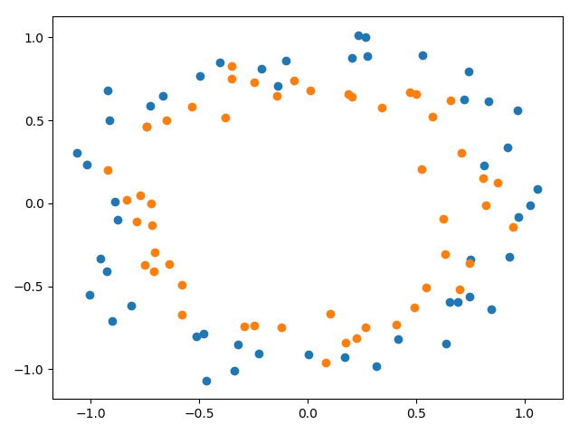

## Findings about promoting robustness with noise

### Problem description

The binary classification problem used to demonstrate the effect of applying noise to address the problem of overfitting
is contrived by means of the scikit-learn `make_circles()` function. Specifically, the dataset consists of 100 examples
(with a 30/70 train/test split) with 2 input features and a noise of 0.1.

### Grid searching standard deviation

Grid searching the standard deviation of the normal distribution used to add noise to the activations of the hidden
layer reveals that a value between `0.1` and `0.3` results in the best test accuracy performance for this particular
kind of problem.

| Standard deviation | Train accuracy | Test accuracy |
|-------------------:|---------------:|--------------:|
| 0.01               | 1.000          | 0.786         |
| 0.03               | 1.000          | 0.800         |
| 0.1                | 1.000          | 0.814         |
| 0.3                | 0.967          | 0.814         |
| 1.0                | 0.833          | 0.643         |
