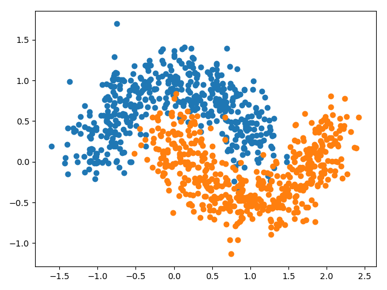

## Findings about halting training at the right time with early stopping

### Problem description

A binary classification problem is used to demonstrate the effect of using early stopping to reduce overfitting of a
model. Specifically, the problem has 2 input features and a dataset size of 100 with a noise of 0.2, which is contrived
using the scikit-learn `make_moons()` function.

### Using true train/dev/test split

When running the same experiment of early stopping and model checkpointing but with a true train/dev/test split of the
data with a ratio of 60/20/20 respectively, the accuracy performances are as follows: `train: 0.900, dev: 0.950,
test: 0.800`. This shows that the model's performance is much better on the validation set than on the test set,
highlighting the importance of using a true train/dev/test split of the data to assess the final model's performance.
