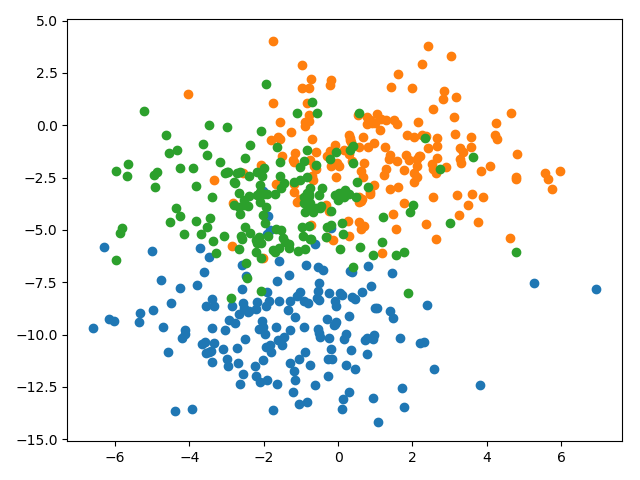

## Findings about combining models from multiple runs with model averaging ensemble

### Problem description

A multiclass classification problem is used to demonstrate the effect of using a model averaging ensemble to reduce the
variance in the model's predictions. Specifically, the problem consists of 3 classes, 2 input features and a dataset
size of 500, which is contrived using the scikit-learn `make_blobs()` function.

### Averaging predicted class labels
When averaging the predicted class labels instead of the predicted class probabilities the mean is practically the same
whereas the standard deviation worsens slightly from `0.008` to `0.010`.
