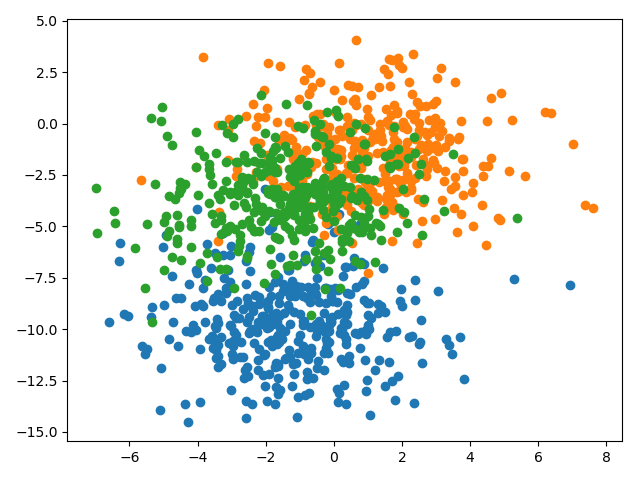

## Findings about contributing proportional to trust with weighted average ensemble

### Problem description

A multiclass classification problem is used to demonstrate the effect of using a weighted average ensemble to improve
the predictions as well as to reduce the variance of the predictions. Specifically, the problem consists of 3 classes, 2
input features and a dataset size of 1100, 100 of which are used for training and the rest for validation and testing.
The dataset is contrived using the scikit-learn `make_blobs()` function.

### Using random search

A random search is used to determine the contributions each ensemble member should have on the final prediction. An
equal number of evaluations is done as with the exhaustive grid search, namely 161'051. The best performance on the test
set was achieved with these ensemble members' weights `[0.38090278 0.03148107 0.48813935 0.05093211 0.04854469]`,
resulting in an accuracy performance of `0.822`. As can be seen, the most weight has been put on model 1 and model 3. In
this particular run, searching for the ensemble members' contributions randomly has resulted in ensemble learning that
outperformed the ensemble model whose contributions have been searched for exhaustively.
