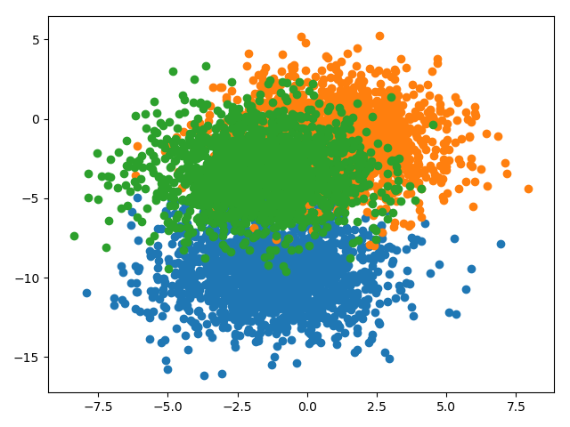

## Findings about fitting models on different samples with resampling ensembles

### Problem description

A multiclass classification problem is used to demonstrate the effect of using resampling ensembles to improve the
predictions as well as to reduce the variance of the predictions. Specifically, the problem consists of 3 classes, 2
input features and a dataset size of 5000, which is contrived using the scikit-learn `make_blobs()` function.

### Single model trained on all data

A single model is trained an all 5000 training examples. The average performance of a repeated evaluation of 15 runs is
a mean accuracy performance of `0.820` with a standard deviation of `0.001`. This result is quite comparable to the
performances achieved by the different resampling ensemble techniques.
