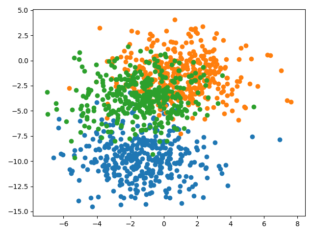

## Findings about learning to combine predictions with stacked generalization ensemble

### Problem description

A multiclass classification problem is used to demonstrate the effect of stacked generalization ensembles to improve the
predictions as well as to reduce the variance of the predictions. Specifically, the problem consists of 3 classes, 2
input features and a dataset size of 1100, 100 of which are used for training and the rest for validation and testing.
The dataset is contrived using the scikit-learn `make_blobs()` function.

### Varying number of level 0 models

A stacked ensemble model is evaluated against different number of level 0 models used in the stacking. The following
figure shows the test accuracies of a stacked ensemble model with 2 to 10 level 0 models.

An upward tendency can be detected the more level 0 models are used. However, the improvements are in the fractions of
percent.
