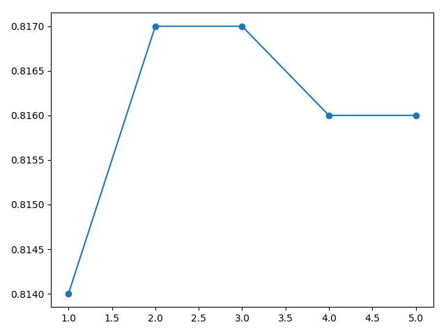

## Findings about combining model parameters with average model weights ensemble

### Problem description

A multiclass classification problem is used to demonstrate the effect of average model weights ensembles to improve the
predictions as well as to reduce the variance of the predictions. Specifically, the problem consists of 3 classes, 2
input features and a dataset size of 1100, 100 of which are used for training and the rest for validation and testing.
The dataset is contrived using the scikit-learn `make_blobs()` function.

### Varying decay rate

An average model weights ensemble is evaluated against different decay rates of an exponentially weighted average. As
can be seen from the figure below, a decay rate of `1` results in poorest performance as the contributions of the
models' weights seem to decrease to fast. A decay rate of `2` or `3` performs best, at least in this particular run,
while performance degrades again as the decay rate increases. This coincides with the evaluation using a linearly
decreasing weighted average, which can be explained by the fact that an increasing decay rate of an exponentially
weighted average approaches a linearly decreasing weighted average.

